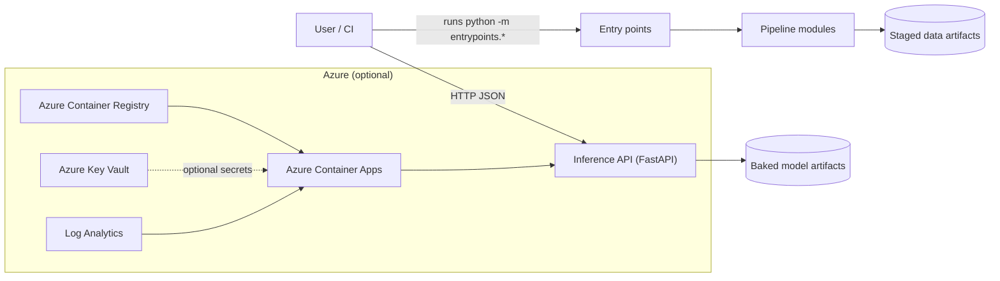
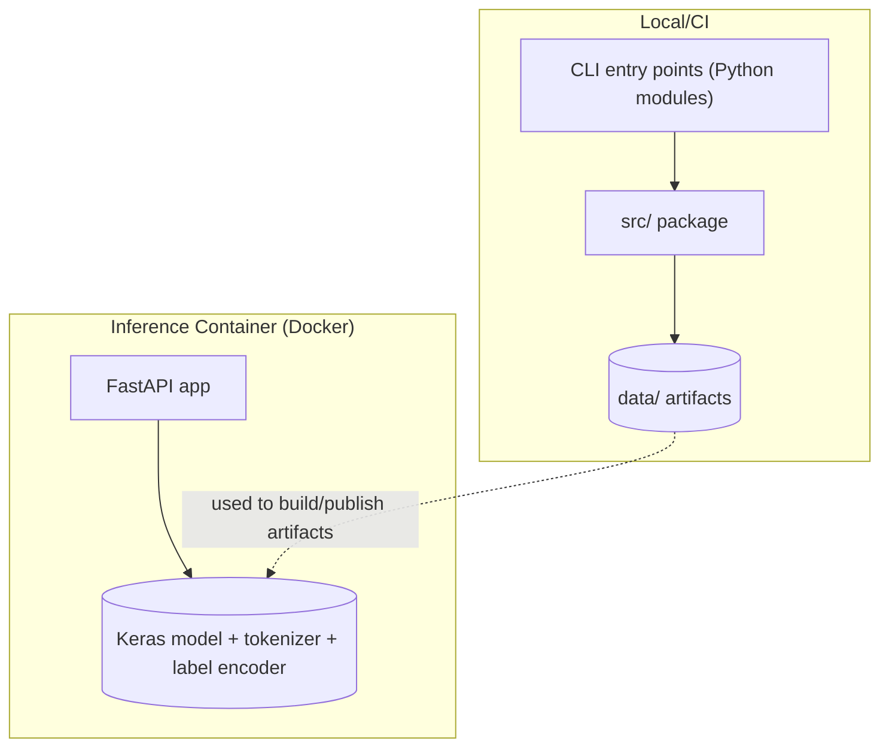
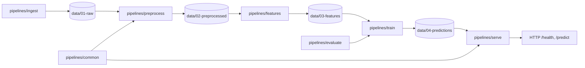

<!-- cSpell:disable -->

# Project Architecture Blueprint

Generated: 2025-12-29

This document describes the *actual* architecture implemented in this repository, based on the current folder structure and code in `src/`, `entrypoints/`, `infra/`, and `tests/`.

---

## 1. Architecture Detection and Analysis

### 1.1 Technology stack (auto-detected)

- **Primary language**: Python 3.11
- **ML / data**: `numpy`, `pandas`, `scikit-learn`, `tensorflow`, `transformers`, `keras_hub`
- **Serving**: **FastAPI** + an ASGI server (see `src/pipelines/serve/`)
- **Packaging layout**: importable Python package under `src/` (`PYTHONPATH=/app` in Docker)
- **Infrastructure as Code**: **Azure Bicep** for Azure Container Apps (see `infra/bicep/`)
- **Tests**: `pytest` (see `tests/`)
- **Containerization**: Docker image that **bakes model artifacts into the image** (see `Dockerfile`)

### 1.2 Architecture pattern (auto-detected)

This repo uses a pragmatic “**pipelines as code**” pattern with:

- **Layered organization by lifecycle stage** (`src/pipelines/{ingest,preprocess,features,train,evaluate,serve}`)
- **Thin executable wrappers** (`entrypoints/`) around reusable library code (`src/pipelines/`)
- **Staged artifact storage** (`data/01-raw → 02-preprocessed → 03-features → 04-predictions`)

In other words: a **monolithic** Python codebase with **modular pipeline stages**, plus a small **service boundary** at the inference API.

---

## 2. Architectural Overview

### 2.1 Guiding principles evident in code

- **Keep I/O at the edges**: most stages are functions that accept a `config` mapping and return paths/outputs; entry points handle CLI arguments.
- **Determinism + reproducibility**:
  - Splits use explicit seeds.
  - Feature fitting is performed on train only.
  - Each stage writes a JSON manifest with metadata.
- **Training/inference parity**:
  - Text assembly logic is centralized in `src/pipelines/common/text.py` and reused by preprocessing and serving.
- **Operational clarity**:
  - Entry points are explicit modules runnable via `python -m ...`.
  - Output artifacts are placed in timestamped run directories under `data/04-predictions/`.

### 2.2 Architectural boundaries and enforcement

- **Boundary: entry points vs. library code**
  - `entrypoints/*.py` should remain “boring”: parse CLI arguments + load config + call pipeline.
- **Boundary: serving vs. training**
  - Serving loads artifacts and exposes HTTP endpoints only; training pipelines write artifacts.
- **Boundary: infra vs. app**
  - Infrastructure as code lives in `infra/` and does not embed secret values.

---

## 3. Architecture Visualization (C4-style diagrams)

### 3.1 C4 — System Context



### 3.2 C4 — Container View



### 3.3 C4 — Component View (pipelines package)



---

## 4. Core Architectural Components

### 4.1 `entrypoints/` (Operational boundary)

#### Purpose (Entry points)

- Provide stable, runnable commands for ingestion, preprocessing, feature extraction, training/evaluation.

#### Internal structure

- Each entry point:
  - parses `--config` and `--force`
  - loads JSON config via `src.pipelines.common.config.load_json_config`
  - normalizes a small set of paths to `Path(...)`
  - calls a single pipeline function

#### Interaction patterns

- Synchronous, in-process calls to pipeline modules.

#### Evolution patterns

- Add a new runnable job by creating a new `entrypoints/*.py` that calls into a new/existing pipeline function.

Representative pattern:

```python
# entrypoints/preprocess_huffpost.py
config = load_json_config(args.config)
outputs = preprocess_huffpost(config, force=args.force)
```

### 4.2 `src/pipelines/common/` (Cross-cutting utilities)

#### Purpose (Common)

- Shared logic used across multiple stages.

#### Key modules

- `common/config.py`: minimal JSON config loader.
- `common/text.py`: canonical text assembly + normalization used by both preprocessing and serving.

#### Why it matters

- Centralizing text assembly prevents training/serving drift.

### 4.3 `src/pipelines/ingest/` (Raw data acquisition)

#### Purpose (Ingest)

- Download dataset into `data/01-raw/` and produce provenance/validation manifest.

#### Implementation highlights (Ingest)

- Streams download to disk while computing SHA-256.
- Validates JSONL schema by sampling records.
- Writes a `.manifest.json` alongside the downloaded file.

### 4.4 `src/pipelines/preprocess/` (Cleaning + splits)

#### Purpose (Preprocess)

- Derive training-ready `text`, apply minimal cleaning, create deterministic splits.

#### Key behaviors (Preprocess)

- Adds `row_id` to support joining predictions back to rows later.
- Enforces dataset contract rules (drop missing category, drop empty text, optional dedupe, optional rare-label drop).
- Creates deterministic train/valid/test splits using a configured seed.
- Writes CSVs + a JSON manifest.

### 4.5 `src/pipelines/features/` (TF-IDF features)

#### Purpose (Features)

- Fit TF-IDF vectorizer on train only, transform splits, and encode labels.

#### Key behaviors (Features)

- Prevents leakage by fitting TF-IDF and label encoder on train.
- Writes:
  - `vectorizer.joblib`
  - `label_encoder.joblib`
  - `X_*.npz` (sparse)
  - `y_*.npy`
  - `features.manifest.json`

### 4.6 `src/pipelines/train/` (Experiments)

#### Purpose (Train)

- Train different model families and write run artifacts under `data/04-predictions/`.

#### Run directory convention

- `data/04-predictions/<experiment_name>/<YYYYMMDDTHHMMSSZ>/`
- Implemented by `src.pipelines.train.common.make_run_dir`.

#### Experiment modules

- `tfidf_logreg.py`: scikit-learn LogisticRegression.
- `tfidf_dense.py`: SVD + small neural network (TensorFlow).
- `distilbert_keras_hub.py`: DistilBERT classification variants (frozen/unfrozen/two-phase).

### 4.7 `src/pipelines/evaluate/` (Metrics/reporting)

#### Purpose (Evaluate)

- Provide standardized metric computation and file output helpers.

#### Key behaviors (Evaluate)

- Computes accuracy and macro-F1.
- Writes:
  - `metrics_*.json`
  - `classification_report_*.txt`
  - `predictions_*.csv`

### 4.8 `src/pipelines/serve/` (Inference API)

#### Purpose (Serve)

- Provide a minimal inference API.

#### Endpoints

- `GET /health`: readiness (artifacts loaded)
- `POST /predict`: accepts `text` or (`headline`, `short_description`) and returns top-k predictions.

#### Artifact loading

- Artifacts are loaded from env-var paths at startup.
- Text assembly uses the same config and helpers as preprocessing.

---

## 5. Architectural Layers and Dependencies

### 5.1 Layer map (as implemented)

- **Interface layer**: `entrypoints/` (CLI) and `src/pipelines/serve/api.py` (HTTP)
- **Application/pipeline layer**: `src/pipelines/{ingest,preprocess,features,train}`
- **Cross-cutting utilities**: `src/pipelines/common/*` and `src/pipelines/evaluate/*`
- **Infrastructure**: `infra/bicep/*`
- **Data/artifacts**: `data/*`

### 5.2 Dependency rules (observed)

- `entrypoints/*` → depend on `src/pipelines/*`
- `src/pipelines/*` → depend on standard libs + ML libs + `common/*` + `evaluate/*`
- `serve/*` depends on trained artifacts but does not depend on training modules.

### 5.3 Notable “guardrails” used

- Shared logic extracted into `common/` (particularly text assembly).
- Manifests and deterministic seeds used to support repeatability.

---

## 6. Data Architecture

### 6.1 Staged storage model

- `data/01-raw/`: immutable raw dataset downloads (JSONL + manifest).
- `data/02-preprocessed/`: cleaned full dataset and split CSVs + manifest.
- `data/03-features/`: TF-IDF features, vectorizer, label encoder + manifest.
- `data/04-predictions/`: per-experiment run directories with metrics/reports/predictions and saved models.

### 6.2 Domain model (implicit)

The “domain model” here is a simple tabular dataset with:

- `category` (label)
- `headline`, `short_description` (raw text fields)
- derived `text` (training/inference input)
- `row_id` (stable join key)

Dataset contract is documented in `config/huffpost_dataset_contract.md`.

### 6.3 Validation rules (implemented)

- Ingestion validates presence of required keys in sampled JSONL records.
- Preprocessing enforces:
  - non-empty label (configurable)
  - non-empty derived text (configurable)
  - optional rare-label dropping

---

## 7. Cross-Cutting Concerns Implementation

### 7.1 Authentication & authorization

- The local FastAPI service does not implement auth.
- If deployed publicly, auth is expected to be handled by platform/front-door/API gateway patterns (not implemented in this repo).

### 7.2 Error handling & resilience

- Pipelines are “fail fast”:
  - missing files raise `FileNotFoundError`
  - missing config keys raise `KeyError`
  - schema violations raise `ValueError`
- The serving API:
  - returns `503` if artifacts fail to load
  - returns `400` for invalid request payloads

### 7.3 Logging & monitoring

- Pipelines rely primarily on standard output prints at the entry point level.
- When deployed to Azure Container Apps, logs flow into Log Analytics (configured in Bicep).

### 7.4 Validation

- Input validation for the HTTP layer is via request-schema models.
- Data validation is performed in pipeline logic (schema checks, cleaning).

### 7.5 Configuration management

- Config is JSON loaded via `load_json_config`.
- Runtime config for serving is mainly via environment variables:
  - `KERAS_MODEL_PATH`, `TOKENIZER_DIR`, `LABEL_ENCODER_PATH`, `TEXT_CONFIG_PATH`, `MAX_LENGTH`

---

## 8. Service Communication Patterns

### 8.1 Service boundaries

- **Single service**: inference API (FastAPI) exposed over HTTP.
- Everything else is batch/offline pipeline execution.

### 8.2 Protocols and formats

- HTTP + JSON for serving.
- CSV/JSON/NPZ/NPY and serialized model artifacts on disk for pipeline stages.

### 8.3 Sync vs async

- Serving: synchronous request/response.
- Pipelines: synchronous batch processes.

---

## 9. Technology-Specific Architectural Patterns (Python)

### 9.1 Module organization

- `src/pipelines/` is a stable import root for pipeline modules.
- Modules are organized by lifecycle stage and kept relatively independent.

### 9.2 OOP vs functional

- Predominantly functional pipeline style (functions accepting config mappings).
- Light usage of `@dataclass` for “outputs” types.

### 9.3 Framework integration

- FastAPI app factory pattern: `create_app()` returns `FastAPI` instance.

---

## 10. Implementation Patterns (Concrete)

### 10.1 Interface design patterns

- “Contract by config”: pipelines expect certain keys; some modules provide `require_keys()`.
- Minimal surface areas per stage: one “main” function per pipeline stage.

### 10.2 Pipeline step template

Typical pipeline stage pattern:

1. Read config sections (`schema`, `paths`, etc.)
2. Validate inputs exist and/or have expected columns
3. Compute artifacts deterministically
4. Write outputs (and refuse overwrite unless `force=True`)
5. Write manifest JSON with:
   - inputs
   - outputs
   - parameters
   - stats

### 10.3 Training run output template

Per experiment split (valid/test):

- `metrics_<split>.json`
- `predictions_<split>.csv`
- `classification_report_<split>.txt`

Plus model artifacts:

- `model.joblib` (scikit-learn) OR `keras_model.keras` (TensorFlow)
- Optional additional artifacts (`svd.joblib`, tokenizer directory)

### 10.4 Serving template

- Load artifacts once at startup
- `GET /health` checks readiness
- `POST /predict`:
  - resolve `text` deterministically from request fields
  - run tokenizer → model → probability normalization
  - return top-k probabilities and predicted label

---

## 11. Testing Architecture

- Tests live in `tests/pipelines/` and focus on:
  - preprocessing text normalization and cleaning behavior
  - TF-IDF vectorizer configuration and leakage prevention

Tools:
 
- `pytest`

---

## 12. Deployment Architecture

### 12.1 Docker image

- `Dockerfile` builds a slim Python image that:
  - installs runtime dependencies from `requirements.serve.txt`
  - copies `src/`, `entrypoints/`, and `config/`
  - **copies selected model artifacts from `data/` into `/app/artifacts/best/`**
  - runs the FastAPI app on port 8080

### 12.2 Azure deployment (optional)

Bicep in `infra/bicep/main.bicep` provisions:

- Azure Container Registry (ACR)
- User-assigned managed identity
- Azure Key Vault (RBAC mode) for secret references (optional)
- Log Analytics workspace
- Container Apps environment
- Container App configured to:
  - pull from ACR using managed identity (no registry password)
  - expose ingress on port 8080
  - probe `/health` for readiness/liveness

---

## 13. Extension and Evolution Patterns (Extensibility-focused)

### 13.1 Adding a new dataset

Recommended approach:

1. Add a new config file under `config/` with:
   - `dataset.*` source
   - `schema.*` column names
   - `paths.*` staged directories/filenames
2. Add `src/pipelines/ingest/<dataset>.py` for download/import.
3. Add `src/pipelines/preprocess/<dataset>.py` that produces the same core columns (`row_id`, `text`, label).
4. Add matching entry points under `entrypoints/`.

Key rule: keep `src/pipelines/common/text.py` as the single authority for text assembly.

### 13.2 Adding a new feature extractor

- Create `src/pipelines/features/<name>.py` with a single `extract_*` function.
- Persist artifacts under `data/03-features/<variant>/` (or update `paths.features_dir` contract).
- Ensure “fit on train only” to prevent leakage.

### 13.3 Adding a new model experiment

- Create `src/pipelines/train/<experiment>.py` with `run_<experiment>_experiment(config, force=False) -> Path`.
- Use `make_run_dir(predictions_dir, experiment_name=...)`.
- Reuse `src/pipelines/evaluate/classification.py` for standardized outputs.

### 13.4 Evolving serving

If you change the trained model family (e.g., from DistilBERT to TF-IDF model):

- Keep the HTTP surface area stable (preferably the same request/response schema).
- Swap internals by changing `load_artifacts()` and `predict_topk()` implementations.

---

## 14. Architectural Pattern Examples (Representative excerpts)

### 14.1 Training/inference parity via shared text helpers

- Canonical implementation: `src/pipelines/common/text.py`
- Used in preprocessing (`src/pipelines/preprocess/huffpost.py`) and serving (`src/pipelines/serve/api.py`)

### 14.2 Deterministic run directory structure

```python
# src/pipelines/train/common.py
run_dir = Path(predictions_dir) / experiment_name / ts
```

### 14.3 “Fit on train only” to prevent leakage

```python
# src/pipelines/features/huffpost_tfidf.py
x_train = vectorizer.fit_transform(train_text)
x_valid = vectorizer.transform(valid_text)
x_test = vectorizer.transform(test_text)
```

---

## 15. Architectural Decision Records (Observed ADRs)

These ADRs are inferred from implementation choices.

### ADR-001: Use staged `data/` layout for artifacts

- **Context**: ML workflows produce multiple intermediate artifacts.
- **Decision**: Store artifacts by stage (`01-raw` → `04-predictions`).
- **Consequences**:
  - (+) Makes it easy to inspect pipeline outputs.
  - (+) Helps avoid accidental overwrite when paired with `--force`.
  - (-) Requires discipline to keep `data/` out of Docker build context, except whitelisted artifacts.

### ADR-002: Keep runnable CLI entry points separate from pipeline modules

- **Context**: Operational runs should be stable and automatable.
- **Decision**: Put “thin wrappers” in `entrypoints/` and reusable logic in `src/pipelines/`.
- **Consequences**:
  - (+) Easier to test pipelines independently of CLI.
  - (+) Clear automation surface (CI, Docker, schedulers).

### ADR-003: Bake best-model artifacts into the inference container

- **Context**: Container Apps deployments often prefer self-contained images.
- **Decision**: Copy selected artifacts into the Docker image and load by env-var paths.
- **Consequences**:
  - (+) Simple runtime (no external artifact store required).
  - (-) Updating the model requires rebuilding/redeploying the container image.

### ADR-004: Prefer managed identity for pulling images and Key Vault references

- **Context**: Avoid secrets in infrastructure as code and deployments.
- **Decision**: Use a user-assigned identity with `AcrPull` and `Key Vault Secrets User`.
- **Consequences**:
  - (+) No registry passwords.
  - (+) Secret values stay in Key Vault.

---

## 16. Architecture Governance

Current governance mechanisms:

- **Tests**: `pytest` validates critical pure functions and leakage prevention.
- **Documentation**: folder-level READMEs establish intended usage patterns.
- **Conventions**:
  - one main function per pipeline stage
  - manifests for traceability
  - stable staged artifact directories

Recommended additions (not implemented here):

- Add `ruff` and CI to enforce linting/formatting.
- Add lightweight config validation (schema checks) in `common/`.

---

## 17. Blueprint for New Development

### 17.1 Development workflow

1. Prototype in `notebooks/`.
2. Move stable logic into `src/pipelines/<stage>/...`.
3. Add or extend an entry point in `entrypoints/`.
4. Write tests under `tests/` for any “pure” logic.
5. If serving changes, update the container artifact contract and rebuild the image.

### 17.2 Implementation templates

- New pipeline stage:
  - `def run_<stage>(config: Mapping[str, Any], *, force: bool = False) -> OutputsType:`
  - write outputs + manifest
- New experiment:
  - `def run_<experiment>_experiment(config: Mapping[str, Any], *, force: bool = False) -> Path:`
  - output to a timestamped run directory

### 17.3 Common pitfalls

- Feature leakage (fit on full dataset instead of train only).
- Training/serving mismatch in text assembly.
- Overwriting artifacts unintentionally (use `--force` intentionally).
- Baking the wrong run’s artifacts into the Docker image.

---

## Keeping this document updated

Update this blueprint when:

- adding a new pipeline stage or experiment
- changing artifact formats or paths
- changing the inference API contract
- changing Azure deployment topology

<!-- cSpell:enable -->
