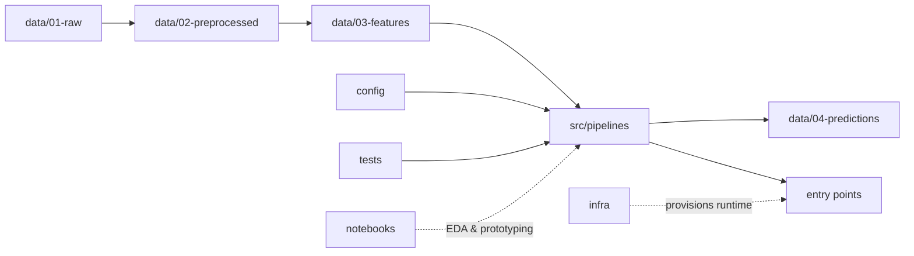

# ML Classification Example (HuffPost Categories)

[](LICENSE)

## What this repo is

This repository is a small, opinionated machine learning project that classifies HuffPost news items into categories.

It includes:

- A **staged data layout** (raw → preprocessed → features → predictions)
- **Pipelines as code** in `src/pipelines/` (ingest, preprocess, features, training, evaluation, serving)
- **Explicit entry points** in `entrypoints/` for repeatable runs (local, CI, Docker)
- A small **FastAPI inference service** (see `src/pipelines/serve/` and the `Dockerfile`)
- **Infrastructure as Code** for Azure Container Apps under `infra/bicep/`

## Technology Stack

This template is intentionally minimal; you choose the libraries that fit your problem.

- **Language:** Python (recommended)
- **Environment management:** `venv` (recommended)
- **Dependencies:** `pip` via `requirements.txt` (starter set included)
- **Notebooks (optional):** Jupyter, stored in `notebooks/`
- **Containerization (optional):** Docker (a ready-to-run `Dockerfile` is included)
- **Testing (recommended):** `pytest`

## Project Architecture

At a high level, the project is organized around a simple ML lifecycle:



- **Data is tracked by stage** in `data/`.
- **Reusable, testable pipeline code** lives in `src/pipelines/`.
- **Runnable scripts** (training/inference) live in `entrypoints/`.
- **Configuration** lives in `config/` (e.g., local vs prod).
- **Notebooks** are for exploration and experimentation, not production code.
- **Infrastructure as Code** lives in `infra/`.

## Getting Started

### Prerequisites

- Python 3.11 recommended
- (Optional) Docker installed

## Quick start (local Python)

From the repo root:

```powershell
python -m venv .venv
\.\.venv\Scripts\Activate.ps1
python -m pip install --upgrade pip
pip install -r requirements.txt
```

### Run the full pipeline (HuffPost)

1. Download raw dataset:

```powershell
python -m entrypoints.download_huffpost_raw --config config/huffpost_category_text.json
```

1. Preprocess + split:

```powershell
python -m entrypoints.preprocess_huffpost --config config/huffpost_category_text.json
```

1. Build TF-IDF features:

```powershell
python -m entrypoints.featurize_huffpost_tfidf --config config/huffpost_category_text.json
```

1. Train/evaluate a baseline model:

```powershell
python -m entrypoints.train_eval_huffpost_tfidf_logreg --config config/huffpost_category_text.json
```

Other training entry points are available (Dense TF-IDF, DistilBERT frozen/unfrozen). See `entrypoints/`.

### Run tests

```powershell
pytest -q
```

## Python Environment Setup

This template assumes an isolated Python environment per project.

1. Create a virtual environment:

```bash
python -m venv .venv
```

1. Activate it:

```bash
# Windows PowerShell
.\.venv\Scripts\Activate.ps1

# macOS/Linux
source .venv/bin/activate
```

1. Install dependencies:

```bash
python -m pip install --upgrade pip
pip install -r requirements.txt
```

1. (Optional) Register a Jupyter kernel for this env:

```bash
python -m ipykernel install --user --name ml-project-structure --display-name "Python (ml-project-structure)"
```

### Setup

1. Set up your environment using the steps in the [Python Environment Setup](#python-environment-setup) section.

1. Start implementing your project:

- Add your training and inference scripts under `entrypoints/`.
- Add pipeline logic under `src/pipelines/`.
- Add tests under `tests/`.

## Project Structure

High-level layout:

```text
config/                 # Configuration (e.g., local vs prod settings)
data/
  01-raw/               # Immutable raw inputs
  02-preprocessed/      # Cleaned/standardized datasets
  03-features/          # Feature matrices / engineered feature sets
  04-predictions/       # Model outputs / predictions
entrypoints/            # Executable scripts (training, inference, batch jobs)
infra/                  # Infrastructure as Code (provisioning/deploy)
notebooks/              # EDA and experiments (kept separate from prod code)
src/
  pipelines/            # Reusable ML pipelines (feature, train, infer)
tests/                  # Unit/integration tests
```

See the folder-level docs for details:

- [config/README.md](config/README.md)
- [data/01-raw/README.md](data/01-raw/README.md)
- [data/02-preprocessed/README.md](data/02-preprocessed/README.md)
- [data/03-features/README.md](data/03-features/README.md)
- [data/04-predictions/README.md](data/04-predictions/README.md)
- [entrypoints/README.md](entrypoints/README.md)
- [infra/README.md](infra/README.md)
- [notebooks/README.md](notebooks/README.md)
- [src/pipelines/README.md](src/pipelines/README.md)
- [tests/README.md](tests/README.md)

## Key Features

- Clear staged `data/` pipeline (raw → preprocessed → features → predictions)
- Pipelines as reusable code (`src/pipelines/`) instead of one-off scripts
- Explicit operational entry points (`entrypoints/`) to simplify automation
- Infrastructure as Code support (`infra/`) for reproducible environments
- Separate configuration directory (`config/`) to avoid hard-coding behavior
- Tests included from the start (`tests/`)
- Notebooks separated from production code (`notebooks/`)

## Development Workflow

No single workflow is enforced, but the structure is designed to support a pragmatic ML loop:

1. Explore and validate assumptions in `notebooks/`.
2. Turn stable logic into pipelines in `src/pipelines/`.
3. Create runnable scripts in `entrypoints/` for training/inference.
4. Add/expand tests in `tests/` as pipelines stabilize.
5. (Optional) Containerize entry points for reproducible runs.
6. (Optional) Provision/deploy runtime resources via `infra/`.

Branching strategy is not prescribed by this template; a common default is feature branches with pull requests into `main`.

## Coding Standards

Python code should follow:

- PEP 8 formatting
- Type hints where practical (`typing` module)
- PEP 257 docstrings for public functions/classes
- Small, composable functions with clear names
- Tests for critical paths and edge cases

If you want to enforce these standards automatically, consider adding tools like `ruff`/`black`/`mypy` and a CI workflow.

## Testing

This template includes a `tests/` directory so you can start testing early.

Recommended approach:

- Use `pytest` for unit tests
- Keep pipelines modular so they’re easy to test
- Cover edge cases (empty inputs, invalid schemas/types, large datasets)

Example (once you add `pytest`):

```bash
pytest
```

## Inference API (Docker)

The Docker image bakes a "best" model and tokenizer into the image, then serves:

- `GET /health`
- `POST /predict`

Build:

```powershell
docker build -t ml-classification-infer-api:local .
```

Note: `data/**` is excluded by default via `.dockerignore` (to keep the build context small). The `Dockerfile` relies on a whitelisted set of baked-in artifacts under `data/`.

Run:

```powershell
docker run --rm -p 8000:8080 ml-classification-infer-api:local
```

Test it:

```powershell
curl.exe http://localhost:8000/health

curl.exe -X POST http://localhost:8000/predict -H "Content-Type: application/json" -d '{"headline":"NASA finds new planet","short_description":"A new exoplanet was discovered.","top_k":3}'
```

## Contributing

This repo is intended as a starting point. If you extend this template:

- Keep the folder responsibilities consistent (pipelines vs entry points vs notebooks)
- Update the relevant folder `README.md` when you add conventions
- Prefer small, testable pipeline functions
- Follow the Python coding standards described above

## License

MIT License. See [LICENSE](LICENSE).
