# HuffPost News Category Classification — Experiment Report

**Project Title:** HuffPost category classification  
**Date:** 2025-12-23  
**Dataset Used:** HuffPost News Category Dataset (41 categories)

---

## B.1: Introduction and Problem Definition

### B.1.1 Problem description and motivation
News publishers and aggregators often need to automatically categorize articles into editorial sections (e.g., *POLITICS*, *TRAVEL*, *STYLE & BEAUTY*) to support:
- Personalized content recommendations
- Better on-site navigation and search
- Workflow automation for editors and moderators

This project tackles **multi-class text classification**: given an article’s text (derived from headline + short description), predict one of **41 HuffPost categories**.

### B.1.2 Project goals
- **Business goal:** Automatically route and tag incoming articles so that end-users see relevant content sooner and editorial teams spend less time on manual labeling.
- **Data-science goal:** Train and evaluate models that predict a HuffPost category from short-form article text, with strong performance across both frequent and rare categories (not just the dominant classes).

### B.1.3 Dataset description
**Source & format**
- The dataset is configured as JSONL and preprocessed into deterministic CSV splits.
- Each example includes `headline` and `short_description`, combined into a single `text` field using a `[SEP]` separator.

**Classes and split sizes (from the latest analysis notebook)**
| split | rows | unique_labels | pct_empty_text |
|---|---:|---:|---:|
| train | 160,681 | 41 | 0.0 |
| valid | 20,086 | 41 | 0.0 |
| test | 20,086 | 41 | 0.0 |

**Class distribution (test split snapshot)**
The label distribution is notably imbalanced. For the best-performing model run (DistilBERT unfrozen), the most frequent test classes include:
- POLITICS (3,274), WELLNESS (1,783), ENTERTAINMENT (1,606), TRAVEL (989), STYLE & BEAUTY (965)

And the least frequent include:
- EDUCATION (100), CULTURE & ARTS (103), LATINO VOICES (113), COLLEGE (114), ENVIRONMENT (132)

**Key challenges**
- **Class imbalance:** frequent categories can dominate accuracy.
- **Semantic overlap:** closely related labels (e.g., WORLD NEWS vs WORLDPOST vs THE WORLDPOST; ARTS vs ARTS & CULTURE vs CULTURE & ARTS).
- **Short, noisy text:** headlines and short descriptions can be ambiguous or context-poor.

---

## B.2: Methodology

### B.2.1 Preprocessing Pipeline
The preprocessing pipeline:
- Loads the raw HuffPost JSONL dataset.
- Builds a derived `text` column by combining `headline` and `short_description` with `[SEP]`.
- Applies basic cleaning:
  - Normalizes whitespace
  - Strips leading/trailing whitespace
  - Drops rows with missing/empty category (configurable)
  - Drops empty / too-short `text` (min length 1)
  - Drops rare labels with fewer than 2 examples (to keep stratified splitting feasible)
- Produces **deterministic stratified splits** (seed = 42) with ratios train/valid/test = 0.8/0.1/0.1.

For feature-based models, TF-IDF extraction:
- Fits a TF-IDF vectorizer on **train only** (to avoid leakage).
- Transforms train/valid/test into sparse matrices.
- Fits a label encoder on **train labels only**.

TF-IDF configuration (from `config/huffpost_category_text.json`):
- `max_features=50,000`
- `ngram_range=(1,2)`
- `min_df=2`, `max_df=0.95`
- `sublinear_tf=True`

### B.2.2 Model architecture and justification
This workspace evaluates four experiment variants:

1) **TF-IDF + Logistic Regression (`tfidf_logreg`)**
- A strong linear baseline for high-dimensional sparse text.
- Configuration: solver `saga`, `C=4.0`, `max_iter=200`.

2) **TF-IDF + TruncatedSVD + Dense MLP (`tfidf_dense`)**
- Compresses sparse TF-IDF features using TruncatedSVD (256 components) and trains a small MLP:
  - hidden units: [256]
  - dropout: 0.2
- Rationale: adds non-linearity and reduces memory pressure vs dense training on 50k features.

3) **DistilBERT with frozen backbone (`distilbert_frozen`)**
- Uses a pretrained DistilBERT backbone (keras_hub preset `distil_bert_base_en_uncased`) and trains only a classifier head.

4) **DistilBERT with unfrozen backbone (`distilbert_unfrozen`)**
- Fine-tunes the full backbone end-to-end with a linear classifier head.
- Rationale: task-specific adaptation typically improves performance on nuanced categories.

DistilBERT input settings:
- Tokenizer truncation/padding to a fixed `max_length` (default 64).
- Model uses the `[CLS]`-token representation (sequence position 0) followed by a Dense layer to produce class logits.

### B.2.3 Training strategy
**Common training settings (from config / pipelines):**
- **Max epochs:** 8
- **Batch size:** 32
- **Early stopping:** monitor `val_loss`, patience 2, restore best weights

**TF-IDF Dense (Keras MLP):**
- Optimizer: Adam (`learning_rate=1e-3`)
- Loss: SparseCategoricalCrossentropy (`from_logits=True`)

**DistilBERT (Keras Hub backbone + Transformers tokenizer):**
- Optimizer: Adam (`learning_rate=5e-5`)
- Loss: SparseCategoricalCrossentropy (`from_logits=True`)
- Frozen vs unfrozen is controlled by `backbone.trainable`.

### B.2.4 Performance validation
- **Split strategy:** Stratified train/valid/test (0.8/0.1/0.1) with fixed seed (42).
- **Validation usage:** Used for early stopping and model selection during training.
- **Test usage:** Held out and used once per experiment for final comparison.
- **Leakage prevention:** TF-IDF vectorizer and label encoder are fit on train only; valid/test are transform-only.

---

## B.3: Results and Evaluation

### B.3.1 Quantitative results

#### Overall test metrics (all experiments)
Macro-F1 is emphasized because it weights all categories equally.

| experiment | test accuracy | test macro-F1 | test weighted-F1 |
|---|---:|---:|---:|
| distilbert_unfrozen | 0.7069 | 0.6048 | 0.6992 |
| tfidf_logreg | 0.6221 | 0.4909 | 0.6045 |
| distilbert_frozen | 0.5650 | 0.3941 | 0.5296 |
| tfidf_dense | 0.5221 | 0.3370 | 0.4866 |

#### Training/validation behavior (post-hoc)
The training pipelines persist final predictions/metrics, but **do not persist per-epoch learning curves**. To still diagnose under/overfitting, the analysis notebook computes **post-hoc Train vs Validation** metrics (log loss, accuracy, macro-F1) for each saved model.

Post-hoc plots saved by the notebook (see the analysis folder):

**DistilBERT (unfrozen; best model)**

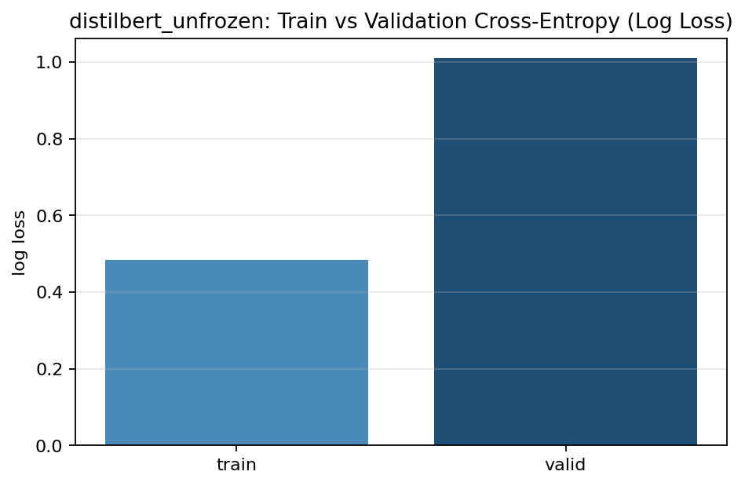

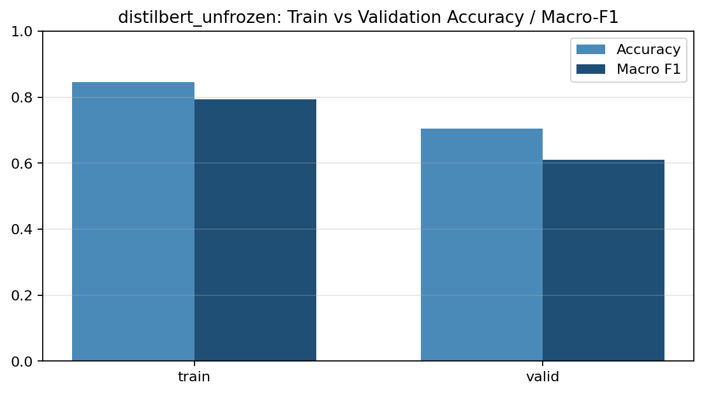

**DistilBERT (frozen)**

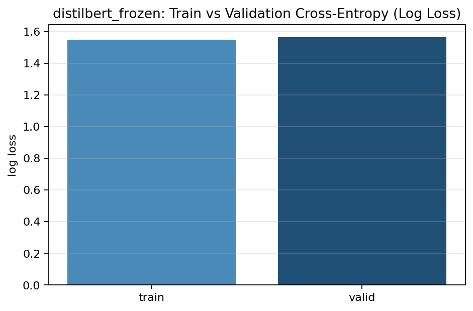

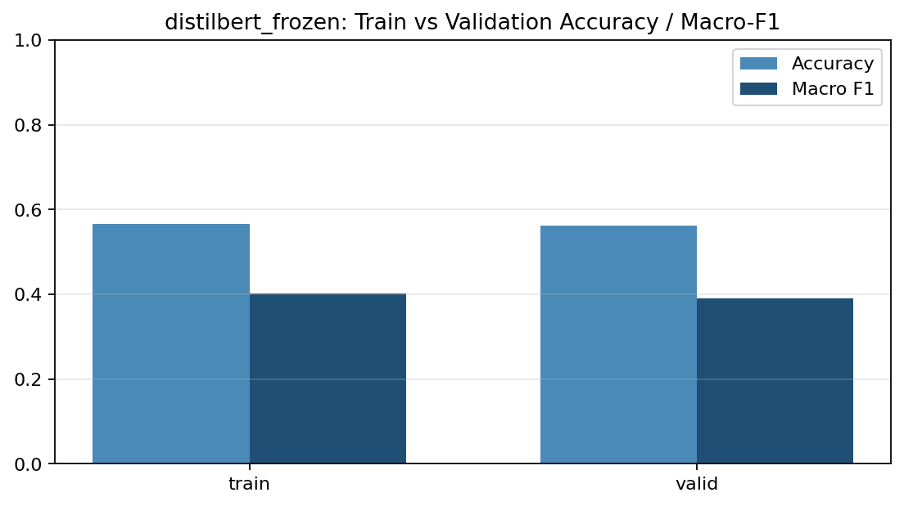

**TF-IDF + Logistic Regression**

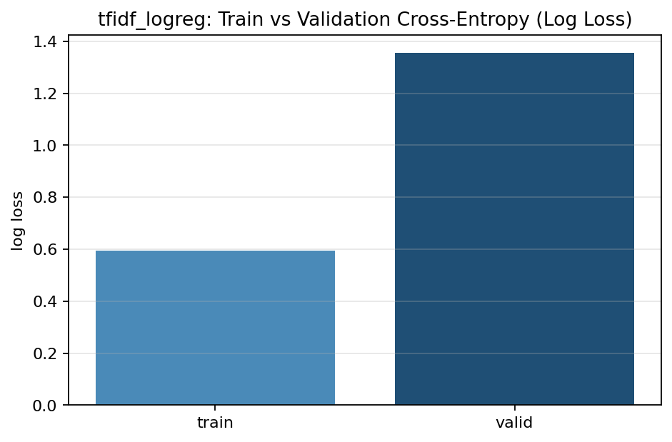

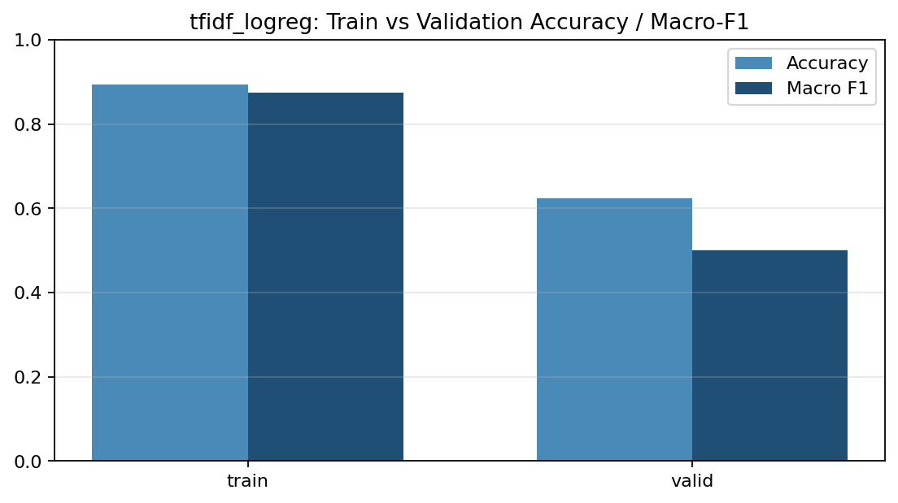

**TF-IDF + Dense MLP**

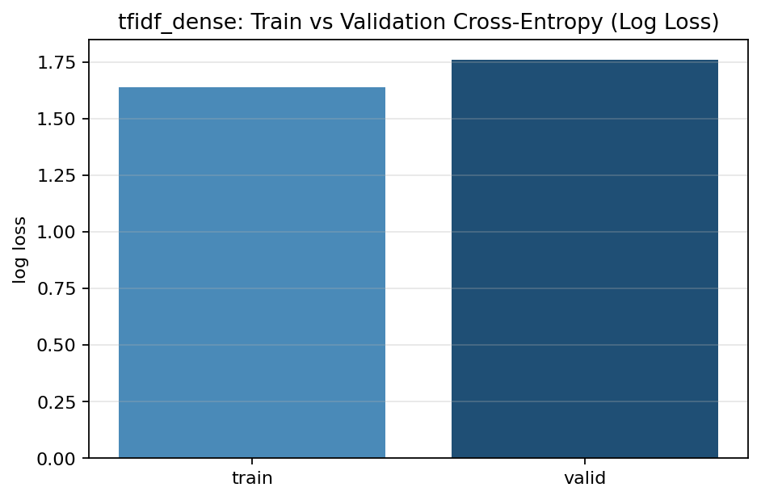

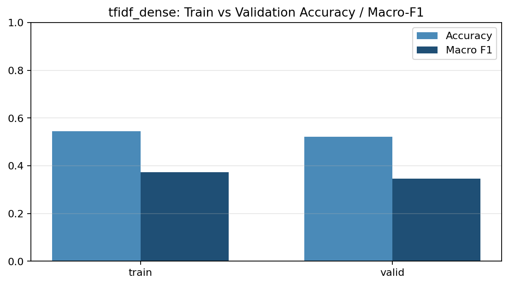

#### Confusion matrix (test)
Confusion matrices are normalized and saved as PNGs per experiment:
- `notebooks/analysis_2025-12-23_09-48/distilbert_unfrozen_confusion_matrix_test.png`
- `notebooks/analysis_2025-12-23_09-48/tfidf_logreg_confusion_matrix_test.png`
- `notebooks/analysis_2025-12-23_09-48/distilbert_frozen_confusion_matrix_test.png`
- `notebooks/analysis_2025-12-23_09-48/tfidf_dense_confusion_matrix_test.png`

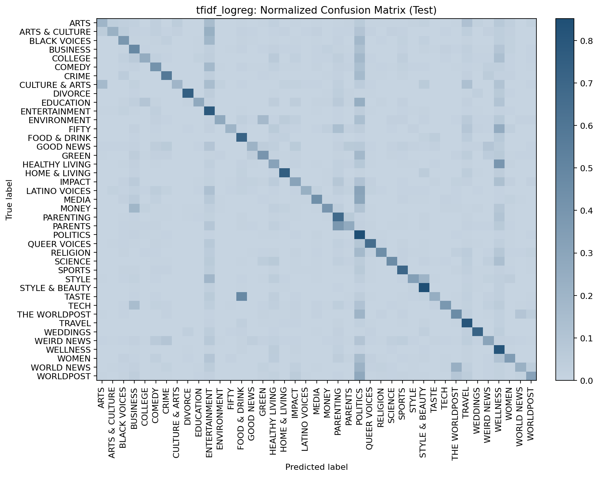

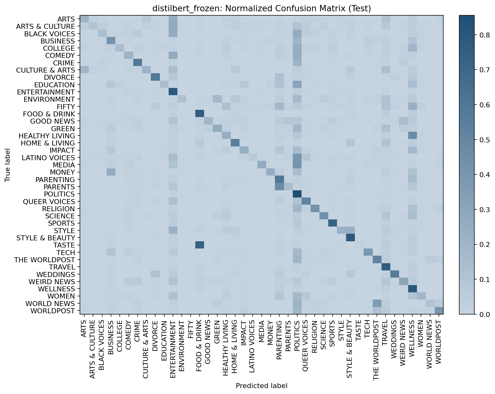

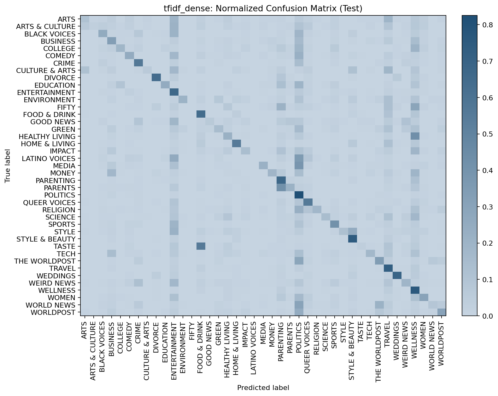

#### Dataset-specific metrics (per-class)
Per-class precision/recall/F1/support is available for each experiment in persisted text reports:
- `data/04-predictions/huffpost/distilbert_unfrozen/20251223T010101Z/classification_report_test.txt`
- `data/04-predictions/huffpost/tfidf_logreg/20251222T183959Z/classification_report_test.txt`
- `data/04-predictions/huffpost/distilbert_frozen/20251222T190244Z/classification_report_test.txt`
- `data/04-predictions/huffpost/tfidf_dense/20251222T184926Z/classification_report_test.txt`

For the best model (DistilBERT unfrozen), the strongest categories by test F1 include:

| class | F1 | support |
|---|---:|---:|
| STYLE & BEAUTY | 0.8676 | 965 |
| DIVORCE | 0.8521 | 343 |
| TRAVEL | 0.8386 | 989 |
| WEDDINGS | 0.8286 | 365 |
| POLITICS | 0.8258 | 3,274 |
| FOOD & DRINK | 0.7902 | 623 |
| SPORTS | 0.7836 | 488 |
| WELLNESS | 0.7792 | 1,783 |

Harder categories by test F1 include:

| class | F1 | support |
|---|---:|---:|
| WORLD NEWS | 0.3096 | 218 |
| GOOD NEWS | 0.3500 | 140 |
| ARTS | 0.4270 | 151 |
| WOMEN | 0.4470 | 349 |
| LATINO VOICES | 0.4509 | 113 |
| COLLEGE | 0.4528 | 114 |
| CULTURE & ARTS | 0.4571 | 103 |
| IMPACT | 0.4585 | 346 |

### B.3.2 Interpretation of results
- **Best overall model:** DistilBERT unfrozen leads on both accuracy and macro-F1, indicating better performance across frequent and rare classes.
- **Overfitting signals:** Post-hoc train vs validation plots for the unfrozen model show train metrics substantially higher than validation, consistent with some overfitting while still generalizing well to the test set.
- **Baselines vs transformer:** TF-IDF + Logistic Regression is a competitive baseline, but struggles more on macro-F1 (rare classes) compared to the fine-tuned transformer.
- **Confusion patterns:** The normalized confusion matrices suggest that closely related categories (especially "world"-themed labels and overlapping arts/culture labels) are more likely to be confused, consistent with semantic overlap and short input text.

### B.3.3 Summary of final model performance
The final selected model is **DistilBERT unfrozen** (run `20251223T010101Z`), chosen by highest test macro-F1.
- **Test accuracy:** 0.7069
- **Test macro-F1:** 0.6048
- **Test weighted-F1:** 0.6992

This performance indicates the task is moderately difficult: the model achieves strong results on many categories, but performance remains uneven on smaller or more ambiguous labels.

---

## B.4: Discussion and Reflection

### B.4.1 Limitations and sources of error
- **Label ambiguity and overlap:** Several categories are semantically close, and short text can lack cues to separate them reliably.
- **Class imbalance:** Rare categories have less training signal; macro-F1 reveals these weaknesses more clearly than accuracy.
- **Limited training telemetry:** Per-epoch learning curves are not persisted; analysis relies on post-hoc comparisons rather than full training dynamics.

### B.4.2 Potential improvements
1) **Address imbalance explicitly**
- Use class-weighted loss or focal loss for neural models.
- Consider oversampling / stratified batch sampling to stabilize rare-class learning.

2) **Improve text signal**
- Incorporate additional fields (e.g., longer article text if available) or richer metadata.
- Try stronger text normalization and domain-specific token cleanup.

3) **Richer modeling + tuning**
- Tune `max_length`, learning rate schedules, and warmup for DistilBERT.
- Explore alternative pretrained backbones (e.g., RoBERTa-style) and/or lightweight adapters.

4) **Better evaluation artifacts**
- Persist per-epoch history (loss/accuracy) and calibration metrics to enable deeper diagnostics.

### B.4.3 Reflection on what you learned
- Macro-F1 is essential for multi-class problems with imbalance; accuracy alone can significantly overstate real-world usefulness.
- Fine-tuning the transformer backbone yields a substantial lift over frozen-backbone and TF-IDF baselines for nuanced category distinctions.
- Reliable, reproducible evaluation artifacts (saved predictions, consistent splits, and clear manifests) make comparative analysis much easier and more trustworthy.
