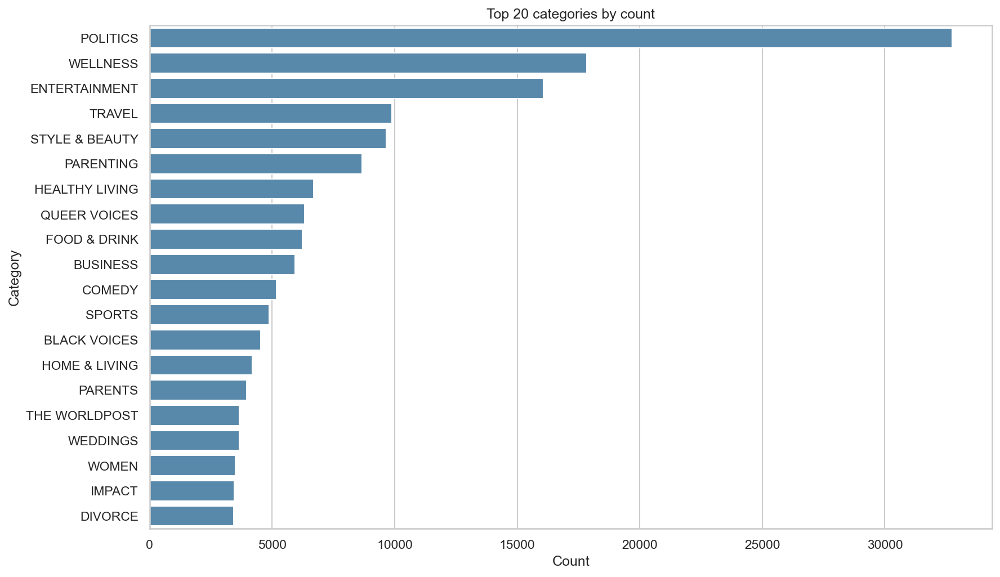
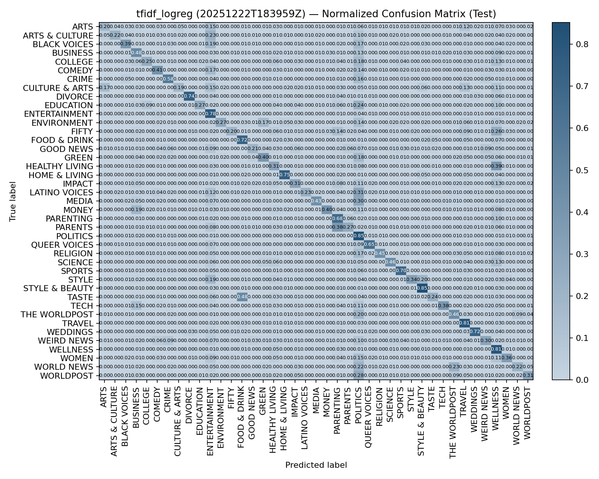

# HuffPost News Category Classification — Experiment Report

<!-- cspell:ignore keras_hub distilbert tfidf logreg -->

**Project Title:** HuffPost category classification  
**Date:** 2025-12-29  
**Dataset Used:** HuffPost News Category Dataset (multi-class)

This report is generated from the latest analysis notebook: `notebooks/analysis_2025-12-24_11-18.ipynb`.

---

## B.1: Introduction and Problem Definition

### B.1.1 Problem description and motivation
News publishers and aggregators need to automatically route incoming content into editorial sections (e.g., *POLITICS*, *TRAVEL*, *STYLE & BEAUTY*) to support:
- Personalized recommendations and email digests
- Better site navigation and search
- Reduced manual triage for editorial teams

This project addresses **multi-class text classification**: given an article’s text (constructed from headline + short description), predict its news category.

### B.1.2 Project goals
- **Business goal:** Auto-tag and route articles into the correct section so content becomes discoverable faster and editorial operations scale without proportional headcount.
- **Data-science goal:** Train models that predict the correct category from short-form article text while maintaining good performance across both frequent and infrequent categories (not just optimizing for the largest labels).

### B.1.3 Dataset description
**Source & format**
- The dataset is configured as JSONL and processed into deterministic CSV splits.
- Each example includes `headline` and `short_description`, combined into a single `text` field using a `[SEP]` separator.

**Classes and distribution (EDA snapshot)**
The EDA artifacts show a strongly imbalanced label distribution. The most frequent categories include:
- POLITICS (16.3%), WELLNESS (8.88%), ENTERTAINMENT (7.99%), TRAVEL (4.92%), STYLE & BEAUTY (4.80%)

Reference EDA plots (generated previously):
- Top categories by count: `notebooks/eda_artifacts/huffpost/top_20_categories_by_count.png`
- Text-length distributions: `notebooks/eda_artifacts/huffpost/text_length_words_hist.png`

**Evaluation label set size (from the latest best-run report)**
- The best model’s test evaluation covers **41 classes**, with **20,086** test examples.

**Key challenges**
- **Class imbalance:** accuracy can be dominated by a few large categories.
- **Semantic overlap:** categories like WORLD NEWS/WORLDPOST/THE WORLDPOST and ARTS/ARTS & CULTURE/CULTURE & ARTS are hard to separate from short snippets.
- **Short, context-poor text:** headlines + short descriptions can be ambiguous, noisy, or incomplete.

---

## B.2: Methodology

### B.2.1 Preprocessing Pipeline
The preprocessing/ingestion pipeline:
- Loads the raw HuffPost JSONL dataset.
- Builds a deterministic `text` field:
  - `text = headline + "[SEP]" + short_description`
  - Nulls replaced with empty strings
  - Whitespace normalized and trimmed
  - Rows with empty text dropped
- Removes problematic labels:
  - Rows with missing/empty category are dropped
  - Rare labels are dropped when they have fewer than 2 examples (to keep splitting feasible)

Splitting:
- **Stratified split** with fixed seed (42)
- Train/valid/test ratios: 0.8 / 0.1 / 0.1

Feature extraction for TF-IDF baselines (from config):
- `max_features=50,000`
- `ngram_range=(1,2)`
- `min_df=2`, `max_df=0.95`
- `sublinear_tf=True`

### B.2.2 Model architecture and justification
This workspace compares two model families:

1) **TF-IDF + Logistic Regression (`tfidf_logreg`)**
- A strong linear baseline for sparse text.
- Often competitive when the signal is mostly lexical.

2) **TF-IDF + TruncatedSVD + Dense MLP (`tfidf_dense`)**
- Reduces sparse dimensionality (SVD) then trains a small neural classifier.
- Adds non-linearity and reduces memory pressure.

3) **DistilBERT fine-tuning variants**
- Uses a pretrained DistilBERT backbone (keras_hub preset `distil_bert_base_en_uncased`) with a lightweight classification head.
- Tokenization uses a Transformers tokenizer with fixed max length (64).

The best-performing approach in the latest analysis is a **two-phase fine-tuning schedule**:
- Warm up classifier head with the backbone frozen
- Then unfreeze the backbone and fine-tune end-to-end

### B.2.3 Training strategy
**Loss**
- Sparse categorical cross-entropy (multiclass classification)

**Optimizers & regularization**
- TF-IDF Dense: Adam (learning rate from config)
- DistilBERT variants: AdamW-style optimization with weight decay for fine-tuning stability

**Two-phase DistilBERT schedule (best model, from config)**
- Warmup: 2 epochs @ learning rate 5e-5 (backbone frozen)
- Fine-tune: 4 epochs @ learning rate 1e-5 (backbone trainable)
- Dropout in classification head: 0.3
- Weight decay: 1e-5

### B.2.4 Performance validation
- Validation split is used for development/model selection without consuming the test set.
- Test split is held out and used to compare experiments.
- Leakage prevention:
  - TF-IDF vectorizer is fit on train only; valid/test are transform-only.
  - Label encoding is fit on train only.

---

## B.3: Results and Evaluation

### B.3.1 Quantitative results
The latest notebook aggregates the most recent run per experiment and ranks by **macro-F1** (tie-breaker: accuracy).

**Overall test metrics (latest run per experiment)**

| experiment | run_id | test accuracy | test macro-F1 |
|---|---|---:|---:|
| distilbert_two_phase | 20251223T165758Z | 0.7124 | 0.6183 |
| distilbert_unfrozen | 20251223T010101Z | 0.7069 | 0.6048 |
| tfidf_logreg | 20251222T183959Z | 0.6221 | 0.4909 |
| distilbert_frozen | 20251222T190244Z | 0.5650 | 0.3941 |
| tfidf_dense | 20251222T184926Z | 0.5221 | 0.3370 |

**Best model summary (DistilBERT two-phase)**
- Accuracy: 0.7124
- Macro-F1: 0.6183
- Weighted-F1: 0.7066
- Classes: 41
- Test examples: 20,086

Per-experiment confusion matrices are saved by the notebook here:
- `notebooks/analysis_2025-12-24_11-18/distilbert_two_phase_20251223T165758Z_confusion_matrix_normalized.png`
- `notebooks/analysis_2025-12-24_11-18/tfidf_logreg_20251222T183959Z_confusion_matrix_normalized.png`

**Training/validation loss curves**
The latest analysis notebook attempts to load per-epoch training curves, but the current training pipelines for these runs primarily persist final metrics/predictions and do not consistently save per-epoch history files. As a result, **per-epoch learning curves are not available** in `notebooks/analysis_2025-12-24_11-18/` for this snapshot.

**Per-class metrics**
The notebook writes per-class reports as CSV per experiment, for example:
- `notebooks/analysis_2025-12-24_11-18/distilbert_two_phase_20251223T165758Z_per_class_report.csv`

For the best model, the strongest categories by F1 include:

| class | F1 | support |
|---|---:|---:|
| STYLE & BEAUTY | 0.8718 | 965 |
| TRAVEL | 0.8394 | 989 |
| HOME & LIVING | 0.8350 | 420 |
| WEDDINGS | 0.8288 | 365 |
| POLITICS | 0.8241 | 3,274 |
| DIVORCE | 0.8208 | 343 |
| SPORTS | 0.7942 | 488 |
| FOOD & DRINK | 0.7891 | 623 |

Harder categories by F1 include:

| class | F1 | support |
|---|---:|---:|
| GOOD NEWS | 0.3408 | 140 |
| WORLD NEWS | 0.3696 | 218 |
| ARTS | 0.4014 | 151 |
| IMPACT | 0.4628 | 346 |
| PARENTS | 0.4653 | 395 |
| WOMEN | 0.4682 | 349 |
| COLLEGE | 0.4701 | 114 |
| CULTURE & ARTS | 0.4712 | 103 |

### B.3.2 Interpretation of results
- **Best vs next-best:** Two-phase fine-tuning improves macro-F1 (0.6183 vs 0.6048) and slightly improves accuracy (0.7124 vs 0.7069) compared with standard unfrozen DistilBERT, suggesting the warmup stabilizes optimization and improves minority-class performance.
- **Baseline gap:** TF-IDF + Logistic Regression is a strong baseline, but it trails transformer fine-tuning substantially on macro-F1, indicating that semantic/phrase-level generalization matters for this task.
- **Hard categories:** Categories like *WORLD NEWS*, *ARTS*, and *CULTURE & ARTS* have lower F1 and are likely impacted by semantic overlap and short-text ambiguity.
- **Easy categories:** Highly distinctive lifestyle topics (*STYLE & BEAUTY*, *TRAVEL*, *WEDDINGS*) show high F1, consistent with stronger lexical cues.

### B.3.3 Summary of final model performance
The best solution in the latest notebook snapshot is **DistilBERT two-phase fine-tuning** (`distilbert_two_phase`, run `20251223T165758Z`).

Why it’s best:
- Highest test macro-F1 across experiments (primary ranking metric)
- Competitive accuracy and strong weighted-F1, indicating it performs well overall while improving balance across classes

What it indicates about task difficulty:
- Achieving ~0.71 accuracy is feasible, but macro-F1 is notably lower (~0.62), reflecting persistent difficulty on minority/overlapping categories.

---

## B.4: Discussion and Reflection

### B.4.1 Limitations and sources of error
- **Label ambiguity and overlap:** Some categories are not cleanly separable from headline + short description alone.
- **Imbalance:** Minority classes remain the primary source of macro-F1 drag.
- **Short text context:** Missing long-form article body limits disambiguation.
- **Training observability:** Lack of persisted per-epoch history makes diagnosing under/overfitting harder post-hoc.

### B.4.2 Potential improvements
1) **Class-weighted loss or focal loss** to explicitly emphasize minority categories and improve macro-F1.
2) **Persist training history artifacts** (loss/accuracy per epoch) and checkpoints for better debugging and reproducibility of learning dynamics.
3) **Longer context / richer text fields** (include additional fields like article snippet/body when available) to reduce ambiguity.
4) **Data cleaning targeted at overlaps** (merge or relabel near-duplicate categories, or create a hierarchy) to reduce confusion.
5) **Hyperparameter tuning for fine-tuning stability** (warmup steps, layer-wise LR decay, gradient clipping, larger max_length) to capture more context.

### B.4.3 Reflection on what you learned
- Macro-F1 is the right “north star” for imbalanced multi-class classification: accuracy alone would overstate success.
- Fine-tuning strategy matters: a warmup phase can materially improve class-balanced performance without major complexity.
- Dataset characteristics (imbalance + label overlap) dominate the remaining error; model capacity helps, but data and label taxonomy improvements are likely the next big wins.
